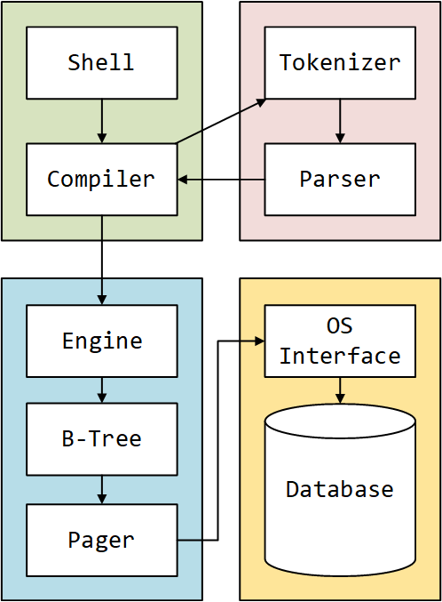

# myDBMS

```
  /$$$$$$  /$$   /$$ /$$$$$$$$ /$$   /$$      
 /$$__  $$| $$  | $$| $$_____/| $$$ | $$      
| $$  \__/| $$  | $$| $$      | $$$$| $$      
| $$      | $$$$$$$$| $$$$$   | $$ $$ $$      
| $$      | $$__  $$| $$__/   | $$  $$$$      
| $$    $$| $$  | $$| $$      | $$\  $$$      
|  $$$$$$/| $$  | $$| $$$$$$$$| $$ \  $$      
 \______/ |__/  |__/|________/|__/  \__/ 
```

设计并实现一个DBMS原型系统，可以接受基本的SQL语句，对其进行词法分析、语法分析，然后解释执行SQL语句，完成对数据库文件的相应操作，实现DBMS的基本功能。

ps: 以下`教科书`特指`西电出版社的《编译原理》`

# 环境说明

* windows11
* GCC/G++ 8.1.0
* Lex(Flex) 2.5.4a
* YACC(Bison) 2.4.1
* CLion 2023
* VSCode 插件`Yash`可以高亮Lex和YACC语法

lex和yacc在UNIX中是标配，所以windows用户需要自己去下载，而linux或者macos用户会方便一些。

下面贴出GNU官方的下载地址。

[Flex Download](https://gnuwin32.sourceforge.net/packages/flex.htm)

[Bison Download](https://gnuwin32.sourceforge.net/packages/bison.htm)

安装之后需要配置环境变量，将`bin`目录添加到系统环境变量就行了。

配置好环境变量后，cmd终端能够找到`bison.exe`和`flex.exe`，所以能够执行命令，查看一下版本号看看配置是否正确。

# 前置知识
1. CMake相关的前置知识: [Quick CMake Tutorial](https://www.jetbrains.com/help/clion/quick-cmake-tutorial.html)
2. 正则表达式: [flex官方说明](https://ftp.gnu.org/old-gnu/Manuals/flex-2.5.4/html_mono/flex.html#SEC7) 或教科书
3. Lex程序基本结构: [简单程序演示](https://ftp.gnu.org/old-gnu/Manuals/flex-2.5.4/html_mono/flex.html#SEC5) 或教科书2.5章
4. YACC程序基本结构: [YACC官方文档](https://www.gnu.org/software/bison/manual/bison.html#Examples) 

# Lex源程序说明

Lex用来生成`词法分析器`（词法分析器生成器），能识别正规式，并执行给定的动作。输出的文件是`.yy.c`后缀。


## Lex源程序结构

Lex源程序的结构被`%%`符号分为三/四部分(查看教科书2.5章):

```c++
%{
Declarations
%}
Definitions
%%
Rules
%%
User subroutines
```
1. Declarations段包含一些C的头文件，宏定义，函数声明，全局变量声明
2. Definitions段包含一些 `正则表达式` 的名字 (比如`digit [0-9]`，digit是名字)
3. Rules段定义`{patterns} {actions}`每一个模式串（正则表达式）对应一个动作（C代码片段）
4. User subroutines段可以定义函数

比如上述文件名为`lex.l`

通过命令`flex lex.l`生成`lex.yy.c`文件，再`gcc`编译生成`.exe`文件，就能对输入记号流进行词法分析。

## 全局变量/函数

**分析源码，需要注意Lex程序中常用的几个全局变量和函数**

| 全局变量/函数      | 说明                                                                                              |
|--------------|-------------------------------------------------------------------------------------------------|
| char *yytext | 输入序列(字符串)                                                                                       |
| int yyleng   | 输入序列的长度                                                                                         |
| int yylex()  | 词法分析驱动器的入口，扫描输入序列后，匹配到`正则表达式`(最长的那一条)，执行对应的`C代码`，返回代码段返回的值(代码段没写返回值yylex()默认返回0)，也就是每个token的标号。 |
| int yywrap() | 词法分析器分析结束时，自动调用yywrap()。如果其返回值为1，则结束分析过程；如果返回值为0，则继续扫描下一个输入。                                    |


## 例子

例子（或参考编译原理2.5章节）：

**识别输入序列，输出记号类型:**

```c++
%{
    #define ID 0
    #define NUMBER 1
%}

char [a-zA-Z]
digit [0-9]
digits {digit}+
optional_fraction ("."{digits})?
optional_exponent (E[+-]?{digits})?

%%
{char}({char}|{digit})* {printf("identified a ID %s: length: %d\n", yytext, yyleng);
                         return ID;}

{digits}{optional_fraction}{optional_exponent} {printf("identified a NUMBER %s: length: %d\n", yytext, yyleng);
                                                return NUMBER;}

%%
int main(void){
    printf("Done, token type: %d\n", yylex());
}

int yywrap(){
    return 1;
}
```
文件名为`mylexer.l`，运行步骤(Windows):

1. lex源程序编译: ```flex .\mylexer.l```
2. 对生成的C源文件`lex.yy.c`编译: ```gcc lex.yy.c```
3. 运行编译完的可执行文件`a.exe`: ```.\a.exe```

程序可以识别两类记号，一种是标识符，一种是数字.

若识别到正则表达式对应的字符串，执行对应的C代码.

main()函数将自动调用生成的yylex()函数。

yylex()执行完之后询问yywrap()，是否需要再扫描后续输入。

# YACC源程序说明

Yet Another Compiler Compiler.

语法分析器生成器。识别手工设计的产生式(Productions)执行对应的语义动作。文件后缀`.y`，输出文件后缀`.tab.c`

## YACC源程序结构

YACC源程序的结构也是类似的三/四段(查看教科书3.5章)

```c++
%{
Declarations
%}
Definitions
%%
Productions
%%
User subroutines
```
这里`Declarations`和`User subroutines`和lex源程序是一样的作用。

特别说明的是`Definitions`段和`Productions`段。

前者比lex源码多了一些YACC转有的变量，后者是定义语法产生式(一说文法，都是grammar)，并且与手写的符号不太一样。

## 关于Definitions段

**改变yylval的默认类型**

查看下面的表格，yylval默认类型其实是int，但是在yacc源文件中可以这样定义他的union从而实现自定义。

```c++
%union {
    int intval;
    char *chval;
}
```

yacc允许yylex()通过yylval传递值：

yacc定义了yylval的union，它将会把yylval的定义写到`y.tab.h`中，所以当`.l`文件中引用了`.tab.h`头文件之后，能够给yylval赋值。（详情查看后续lex和yacc联合使用）

**非终结符**

```c++
%type<chval> tableName // 这里chval是上述联合体中定义的char *chval
```

在后续语法定义中tableName将作为非终结符，这意味着他可以进一步推导。

**终结符**

用`token`定义

```c++
%token NUMBER
```

**结合性和优先级**

```c++
%left '+' '-'
%left '*' '/'
```
变量`left`代表左结合，同一行的符号优先级相同。下面行的优先级比上面行的高。

## 关于Productions段

除了一般的文法，还要注意YACC默认把第一条产生式当作开始的产生式。

**这一点非常重要！**

下面举例说明：

```c++
// Productions段
createStatement:
    CREATE TABLE tableName ';'
    ;

queryStatement:
    SELECT columnName FROM tableName ';'
    ;
    
//如果后面还有文法产生式，也将因为无法从S推导，而无法识别
```

如果先读取到了`SELECT`语句，将无法识别，因为一切语法分析要从第一条产生式开始。

所以在上述例子中，最好是这样定义Productions段:

```c++
// Productions段
statements:
    createStatement
    | queryStatement
    ;

createStatement:
    CREATE TABLE tableName ';'
    ;

queryStatement:
    SELECT columnName FROM tableName ';'
    ;
```

这样第一条产生式就可以有多种选择。

## 全局变量/函数

| 全局变量/函数        | 说明                                                                                        |
|----------------|-------------------------------------------------------------------------------------------|
| YYSTYPE yylval | YYSTYPE类型（其实就是int），默认是int，可以通过union自定义。存储当前词法单元的属性值                                       |
| char *yytext   | 同lex中的yytext，指向当前匹配的输入字符串                                                                 |
| int yyleng     | 同lex中的yyleng，表示当前匹配的输入字符串的长度                                                              |
| int yylex()    | 同lex中的yylex()，词法分析器函数                                                                     |
| int yyparse()  | 语法分析器函数，解析输入内容，并根据语法规则执行对应代码。返回值有三种:YYACCEPT(0)、YYABORT(1)、YYNOMEM(2)分别代表接受、语法错误、内存不足的情况。 |
| void yyerror() | 错误处理，用户自定义                                                                                |
| int yywrap()   | 同lex中的yywrap()，返回1表示输入结束，0表示还有输入                                                          |

**特别地，在产生式中，对应的动作**（也就是对应的C代码段，原文actions）可以使用`$`符号指代产生式的左部或者右部的某个符号。

```c++
$1、$2 和 $$ 的使用
$n：用于访问产生式右侧第 n 个符号的值。$1 表示第一个符号的值，$2 表示第二个符号的值，依此类推。
$$：用于表示产生式左侧非终结符的值。

......前文省略
%%

expr : expr '+' expr { printf("Result: %d\n", $1.intval + $3.intval); }
     | expr '-' expr { printf("Result: %d\n", $1.intval - $3.intval); }
     | expr '*' expr { printf("Result: %d\n", $1.intval * $3.intval); }
     | expr '/' expr { printf("Result: %d\n", $1.intval / $3.intval); }
     | NUMBER        { $$ = $1.intval; }
     ;

%%
......后文省略
```

## 例子

这里是单个YACC程序，没有配合lex。用户手动输入代替lex词法分析之后产生的token stream.

所以手动定义了yylex()，后续lex和YACC配合时，yylex()由lex自动生成。

```c++
%{
    #include<ctype.h>
    #include<stdio.h>
    int yylex();
    void yyerror(const char*);
%}

%token NUMBER
%left '+' '-'
%left '*' '/'

%% // 这里是产生式 expr是非终结符，NUMBER是终结符
expr : expr '+' expr    {printf("Identified [add].\n");}
     | expr '-' expr    {printf("Identified [sub].\n");}
     | expr '*' expr    {printf("Identified [multiply].\n");}
     | expr '/' expr    {printf("Identified [divide].\n");}
     | '(' expr ')'     {printf("Identified [round bracket].\n");}
     | NUMBER           {printf("Identified [NUMBER].\n");}
     ;
%%

int main(void){
    return yyparse();
}

int yylex(void){
    int c;
    while((c = getchar()) == ' ');
    if(isdigit(c)){
        ungetc(c, stdin);
        scanf("%d", &yylval);
        return NUMBER;
    }
    if(c == '\n')return 0;
    return c;
}

void yyerror(const char *s){
    printf("%s", s);
}
```

文件名为`myparser.y`，运行步骤(Windows):

1. 编译.y程序: ```bison .\myparser.y```
2. 编译生成的C程序: ```gcc .\myparser.tab.c```
3. 执行生成的可执行文件: ```.\a.exe```

输入字符串(其实是token stream)，可以识别表达式。

这里是main()函数调用yyparse()函数

而yyparse()将调用yylex()函数 *(这里因为只由一个YACC程序组成，所以yylex()函数是用户自定义的)* 获取输入的token，并语法分析

匹配到产生式就执行对应的代码段。

# Lex和YACC联合编程

没啥区别，主要在于yylval和yylex()这些变量/函数的链接。

## yylval在Lex程序中的赋值
yylval是在YACC程序中定义的，而yylex()是在Lex程序中自动生成的(也就是{patterns} {actions}里面的actions)

当前目录下的`test`文件夹中测试了两个文件`test.l`和`test.y`

要保证Lex程序中能给`yylval`赋值，从而让YACC程序进一步操作，就要在Lex程序中添加YACC程序的头文件（**因为`yylval`是在YACC程序中定义的**）

所以编译YACC程序就要顺便生成YACC的头文件，以便Lex程序包含，从而使用`yylval`变量。

## yylex()在YACC程序中被调用

前文提到过，yylex()是在Lex程序中根据模式串自动生成的函数。

YACC程序中，yyparse()将自动调用yylex()程序(这也是为什么YACC单独运行时，需要用户自定义yylex()函数)

所以YACC源程序中要声明yylex()函数。

## 例子

其次，上述Lex单独运行和YACC单独运行时，都自定义了main函数。

下面的例子是main函数定义在`test.y`中，当然也可以在其他文件中定义main()，然后调用`yyparse()`

`test.l`和`test.y`(自己写的一个测试样例，内容很简单，只需要理解如何编译他们)

```c++
// in test.l
%{
#include "test.tab.h"
%}

NUM [1-9]+[0-9]*|0

%%

{NUM}		                return NUM;
[ \t]+                     /* ignore whitespace */;
.

%%


int yywrap(){
return 1;
}
```

看一下`test.y`:

```c++
%{
    #include <stdio.h>
    #include <string.h>
    int yylex(void);
    void yyerror(char *);
%}

%token NUM

%%
expr:
    NUM {printf("This is a number.\n")};
    ;
%%
void yyerror(char *str){
    fprintf(stderr,"error:%s\n",str);
}

int main() // 后续这里可以注释掉，别的地方调用yyparse()
{
    yyparse();
}
```

大体上是识别数字。

首先要编译`test.l`和`test.y`文件，下面用Flex和Bison演示。

```shell
flex test.l
bison -d test.y
```
不同的点在于bison命令行参数的`-d`，这里会生成`test.tab.c`和`test.tab.h`文件，从而让lex程序包含yylval。

接下来两个文件编译

```shell
gcc -o test test.tab.c lex.yy.c
```
这样就能够生成`test.exe`文件了，执行是没问题的。(上述是纯C文件的编译)

## 模块化

问题在于，我并不想在`test.tab.c`中就直接进入入口`main()`，我可能需要给项目分模块，词法分析、语法分析只是其中一块而已。

这时候就需要将`test.y`中的`main()`删除了，毕竟程序的入口`main()`我们需要放在别的地方。

这样会有两个新问题：

1. 那在别的文件中，怎么调用词法分析、语法分析这一块内容呢？
2. 上述的测试都是在标准输入/输出中进行的，如果我有一个`shell`,这个`shell`从标准输入中读取字符串，再交给`编译器`这个模块来解析，岂不是lex和YACC要传入字符串了（而不是从标准输入中读取）？

其实都是很好解决的问题：

Flex官方文档给出了如下说明:

`Three routines are available for setting up input buffers for scanning in-memory strings instead of files. `

其中一个就是`yy_scan_string(const char *str)`，这意味着，可以将指定的字符串作为Lex的输入流，然后yylex()函数将从这个输入流中进行词法分析，再将分析结果传给yyparse().

所以，`test.l`和`test.y`这一个模块，可以被外部调用，只需要利用好`yy_scan_string()`和`yyparse()`（因为yyparse()内部会调用yylex()）即可。

下面是一个例子`main.cpp`:

```c++
//很重要
int yyparse(void); // 从别的文件找这些函数
void yy_scan_string(const char* str);


int main() {
    std::string inputLine;

    // 从标准输入读取一行
    std::getline(std::cin, inputLine);

    // 将输入字符串传递给词法分析器
    yy_scan_string(inputLine.c_str()); // c风格的string，其实就是char*

    // 调用语法分析器
    yyparse();

    return 0;
}
```

**注意！CPP和C混合编程，C和C++编译器会有不太一样的表现，这里是关于名字改编的问题，上述代码在test文件夹下，用下面的编译命令能够正常运行**

```shell
flex test.l
bison -d test.y
g++ -o lex.yy.c test.tab.c main.cpp
```

在CPP文件中，如果要用到`yyparse()`和`yy_scan_string()`这些来自C文件的函数，就要加上`extern "C"`的关键字。

```c++
//很重要
extern "C"{
    int yyparse(void); // 从别的文件找这些函数
    void yy_scan_string(const char* str);
}
```

自己注意就行，总之能够调用这两个函数就可以了。

如果要在`parser.y`中用到cpp的某些特性，比如类或者某些集合，那么你就需要保证你用`lex`和`yacc`编译的文件是`.cpp/.hpp`的，从而尽量避免C和CPP混合编程带来的`undefine reference`的链接问题。

要么纯C要么纯CPP，C和CPP混合的话，还是挺麻烦的，除非你能做到完美分离前后端。

如果你要纯CPP的话，`flex`源文件可以在开头加上`%option outfile = "lex.yy.cpp"`，这样`flex lex.l`编译出来的文件就是`lex.yy.cpp`(可改名)

使用`yyparse()`和`yy_scan_string()`的话，就不用加上`extern "C"`的关键字了。

# 数据库设计

## myDBMS Architecture

概览如下图:



`Shell`和`Compiler`部分属于`Front-End`部分。

`Engine`以及后续的部分属于`Back-End`部分。

这一点参考的官方[Architecture of SQLite](https://www.sqlite.org/arch.html)

## 编译器设计

### Tokenizer

lex程序比较简单，没什么特别需要注意的地方，本人遇到的两个bug需要注意。

一个是关于NUMBER的正则表达式，之前使用的是:

`[-+]?[1-9][0-9]*`，其实这个表达式不包含0，一定要注意多测试前端的问题。

后续修复这样:

`[-+]?[0-9]+`

另一个是关于STRING的正则表达式，很容易想到:

`'.*'`

也就是两个单引号包含一个任意字符闭包。

看起来没什么问题，但是实际上如果出现多个字符:

`SELECT * FROM table WHERE name = 'test' AND money = 'infinity';`

将会出现难以调试的bug。有可能会把`test' AND money = 'infinity`作为两个单引号的内容，导致bug。

建议改成:

`"'"[^']*"'"`

### Parser


## 存储结构设计

采取分页的思想，一个文件为一张表，一张表内有若干页，一页内有若干行。

对于每一个页：

* 首先要有一个`File Header`，除了表明页的信息外，还有两个指针，分别指向上一页和下一页。
* 再来一个`Page Header`，存储一些该页的状态信息。
* 再设计一个`Infimum + Supermum`，用来记录当前页最小和最大的记录。
* 接下来设计一个`Page Directory`，对下文的`User Records`做一个简单索引。
* 最后才是`User Records`用来存储每一行的数据，数据之间物理上按先后顺序存储，逻辑上按主键顺序形成单链表。
